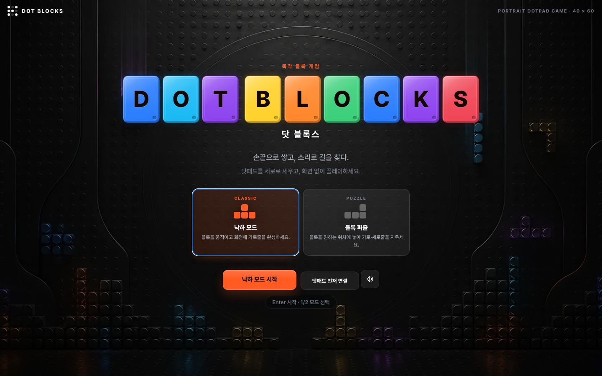

# 🧩 DOT BLOCKS

### 시각장애인 우선 세로형 DotPad 블록 게임

닷패드의 촉각 그래픽 · 기능키 · 음성 · 방향 효과음만으로 완주할 수 있는 블록 게임

---

이 저장소 루트가 곧 게임입니다 — 인트로 → 플레이 화면이 **같은 주소에서 그대로 이어집니다**.
화면 UI 없이 촉각·음성 중심으로 더 단순화한 변형은 [`blind-first-standalone/`](blind-first-standalone/README.md)에 따로 있습니다.

## 목차

- [게임 모드](#-게임-모드)
- [촉각 표현](#-촉각-표현)
- [청각 표현](#-청각-표현)
- [키보드](#-키보드)
- [DotPad 키](#-dotpad-키)
- [모바일 제스처](#-모바일-제스처)
- [URL 옵션](#-url-옵션)
- [닷게임즈 플랫폼 연동](#-닷게임즈-플랫폼-연동)
- [화면 및 에셋 구조](#-화면-및-에셋-구조)
- [기술 파일](#-기술-파일)

## 🎮 게임 모드

### 1. 낙하 모드

- 10×20 보드, 셀당 4×3핀
- 7-bag 블록 생성
- 좌우 이동, 회전, 소프트/하드 드롭
- 다음 블록, 블록 보관, 콤보, 점수, 레벨
- 촉각 친화 잠금 유예: 바닥에 닿은 뒤에도 이동·회전 가능
- 여유/표준/도전 낙하 속도
- 위험 높이 음성·효과음·측면 핀 경고
- 촉각 표면 스캔: 낙하를 잠시 멈추고 10개 열의 최고 높이를 강조

### 2. 블록 퍼즐 모드

- 8×12 보드, 셀당 5×5핀
- 매 라운드 제공되는 3개 블록 선택
- 위치 이동, 회전, 배치
- 가로 또는 세로 줄 삭제
- 겹치는 위치는 X자 촉각 질감
- 행별 점유 상태 상세 읽기

## 🖐 촉각 표현

| 핀 질감 | 의미 |
|---|---|
| 이음선 없이 꽉 찬 덩어리 | 현재 조작 중인 블록 |
| 층마다 얇은 틈이 있는 이어진 면 | 이미 고정된 블록 |
| 조각 사이의 1핀 틈 | 고정된 조각끼리의 경계 |
| 한 줄 가로선 | 현재 블록의 예상 착지 위치 |
| X자 질감 | 퍼즐 블록을 놓을 수 없는 위치 |
| 열의 윗면만 표시 | 촉각 표면 스캔 모드 |
| 상단 좌우 경고점 | 낙하 모드 위험 높이 |

낙하 모드 셀은 4×3핀뿐이라 그 크기에서 "테두리"는 12핀 중 10핀이 올라간 상태여서 손끝에는
그냥 꽉 찬 덩어리로 읽힙니다. 그래서 테두리는 쓰지 않습니다.

두 질감 모두 **셀 전체 폭을 채워** 가로로 인접한 칸이 이음선 없이 붙습니다. 쌓인 블록의
윗면 윤곽을 손으로 훑어 읽는 것이 이 게임의 핵심 판단이고, 칸마다 떨어진 점은 그 윤곽을
찾기 어렵게 만들기 때문입니다. 둘을 가르는 것은 밀도가 아니라 **이음선의 유무**입니다.
현재 블록은 셀을 끝까지 채워 내부에 틈이 전혀 없고(4×3=12핀), 고정 블록은 각 칸의 마지막
한 행을 비워 층마다 얇은 틈이 남습니다(4×2=8핀). 블록이 스택 위에 얹혀도 "틈 없는 덩어리"와
"층층이 갈린 면"으로 구별되고, 동시에 틈이 몇 칸 쌓였는지 세는 기준이 됩니다.

가로로 붙는 것은 **같은 조각의 칸끼리만**입니다. 서로 다른 조각 사이에는 1핀 틈이 남아서,
스택을 훑으면 어떤 조각이 어떤 모양으로 맞물려 있는지 개별로 만져집니다. 조각이 스택에
흡수돼 형태가 사라지면 방금 놓은 블록이 어디로 갔는지 알 수 없기 때문입니다. 고정되는
순간에는 그 조각의 자리만 한 번 강조하는 촉각 펄스도 나갑니다(줄이 삭제될 때는 생략).

## 🔊 청각 표현

- 좌우 위치: 스테레오 방향
- 블록 높이: 효과음 음높이
- 회전/충돌/착지/고정/줄 삭제: 서로 다른 짧은 이어콘
- 위험 높이: 두 번 울리는 낮은 경고음
- 음성 안내가 나올 때 배경음악 자동 감쇠
- 음성, 방향 효과음, 배경음악을 각각 독립적으로 끌 수 있음

배경음악은 외부 음원 파일을 사용하지 않는 **Web Audio 기반 절차형 음악**입니다. 소스 코드는 `audio-engine.js`이며 CC0-1.0으로 배포됩니다.

## ⌨️ 키보드

### 낙하 모드

- `← / →`: 이동
- `↑` 또는 `X`: 회전
- `↓`: 한 칸 내리기
- `Space`: 즉시 낙하
- `C`: 블록 보관
- `P`: 일시정지
- `S`: 현재 블록·위치·착지·점수 읽기
- `Q`: 촉각 표면 스캔

### 블록 퍼즐

- 방향키: 위치 이동
- `R`: 회전
- `Tab`: 다음 블록 선택
- `Space` 또는 `Enter`: 배치
- `S`: 현재 블록과 위치 읽기
- `Q`: 상세 보드 스캔

### 공통

- `1`: 낙하 모드 즉시 시작
- `2`: 블록 퍼즐 즉시 시작
- `H`: 촉각 중심 도움말
- `N`: 새 게임
- `O`: 세로 회전 방향 변경

## 🎛 DotPad 키

### 낙하 모드

- F1: 왼쪽
- F2: 오른쪽
- F3: 회전
- F4: 한 칸 아래
- F1+F2: 블록 보관
- 오른쪽 패닝: 즉시 낙하
- 왼쪽 패닝: 현재 상태 읽기
- 전체 패닝: 촉각 표면 스캔
- 오른쪽 기능키 RPF4: 일시정지/계속
- F3+F4: 상세 표면 상태 읽기
- LPF1: 새 게임

### 블록 퍼즐

- F1/F2/F3/F4: 왼쪽/오른쪽/위/아래
- 왼쪽 패닝: 회전
- 오른쪽 패닝: 다음 블록
- 전체 패닝: 배치
- F1+F2: 상세 보드 상태
- 오른쪽 기능키 RPF4: 현재 상태
- LPF1: 새 게임

## 📱 모바일 제스처

### 낙하 모드

- 탭: 회전
- 좌우 스와이프: 이동
- 아래 스와이프: 즉시 낙하
- 위 스와이프: 블록 보관

### 블록 퍼즐

- 탭: 배치
- 상하좌우 스와이프: 위치 이동

## 🔗 URL 옵션

- `?mode=drop` 또는 `?mode=puzzle`
- `?lang=ko` 또는 `?lang=en`
- `?embed=1`
- `?preview=1`
- `?rotate=cw` 또는 `?rotate=ccw`

예: `https://byeol-coder.github.io/dot-blocks/?mode=puzzle&lang=en`

## 🔌 닷게임즈 플랫폼 연동

`dot-games-host`에 얹으면 별도 수정 없이 다음이 동작합니다.

- **음성**: 임베드로 실행될 때만 루트의 `/tts.js`를 불러 플랫폼 `TW_TTS`를 사용하고, 서버 음성(`/api/tts`)도 이때만 씁니다. 단독 실행에서는 두 요청 모두 나가지 않고 저장소에 포함된 `superdot-tts-core.js`의 브라우저 음성을 씁니다.
- **소리 토글**: 음성·방향 효과음·배경음악을 한 번에 끄는 공통 컴포넌트를 인트로와 컨트롤 도크에 노출합니다. 끄기 직전 상태를 기억했다가 다시 켤 때 복원하며, 설정 서랍의 개별 스위치와 양방향으로 동기화됩니다.
- **호스트 메시지**: 부모 프레임에 `postMessage({source:'dotarcade', game:'dot-blocks', type, …})`로 아래를 보냅니다.

  | type | 시점 | 함께 보내는 값 |
  |---|---|---|
  | `ready` | 초기화 완료 | `modes`, `lang` |
  | `resize` | 최초 1회 및 창 크기 변경 | `width`, `height` |
  | `gameStart` | 게임 시작 | `mode` |
  | `gameEnd` | 게임 종료 | `mode`, `score`, `lines`, `level` |
  | `exit` | 홈 버튼 | — |

  수신은 `tw:pause`, `tw:resume`, `tw:setLang`(`lang: 'ko' | 'en'`)입니다. 부모 프레임이 없으면 전부 무시되므로 단독 실행에도 영향이 없습니다.

## 🧩 화면 및 에셋 구조

두 화면 모두 **세로 Flex 한 덩어리**입니다. 상단 영역은 위에 고정되고, 가운데 영역이 남는 높이를 전부 차지하면서 콘텐츠를 정중앙에 놓고, 안내·컨트롤은 아래에 고정됩니다. 컨트롤 개수나 상태 문구 길이가 달라져도 보드 위치가 흔들리지 않습니다.

- **인트로 화면**: 배경 WebP 위에 게임명, 설명, 모드 카드, 시작·연결·소리 버튼을 HTML/CSS로 배치
- **플레이 화면**: 상단 상태 필 → 중앙 보드 → 조작 안내 → 컨트롤 도크.
  데스크톱은 좌(다음·보관)·중앙(보드)·우(기록) 3열, 820px 이하에서는 좌우 패널을 숨기지 않고 보드 위 가로 HUD로 재배치
- **설정 패널**: 조작법, 닷패드 기능키, 점자 표시줄, 소리 및 접근성 설정을 오른쪽 서랍에 수납
- **일시정지 화면**: 게임 중단 상태와 계속하기 버튼만 제공
- **결과 화면**: 최종 점수, 다시 플레이, 모드 선택만 제공

기본 테트로미노는 이미지가 아니라 Canvas 셀 조합으로 그립니다. 이동, 회전, 삭제, 반응형 크기, 고대비 대응이 안정적이며 화면 렌더링과 40×60 촉각 데이터는 서로 분리됩니다.

보드를 감싼 닷패드 베젤(`assets/board-frame.webp`)은 배경이 아니라 **보드 셸 요소**입니다. 아트워크의 안쪽 창이 398×816으로 보드의 1:2 비율과 같아서, 화면 배경으로 깔면 뷰포트 비율에 따라 캔버스와 어긋납니다. 프레임 비율(`473 / 889`)과 안쪽 창에서 환산한 퍼센트 패딩을 셸에 직접 주어 어떤 크기에서도 1px 이내로 맞물립니다. 플레이 화면 배경 자체는 CSS로 생성해 인트로와 구분합니다. 자세한 기준은 [`assets/ASSETS.md`](assets/ASSETS.md)를 참고하세요.

## 📁 기술 파일

- `index.html`: UI, 게임 규칙, 촉각 프레임, DotPad 입출력
- `audio-engine.js`: CC0 절차형 BGM과 방향 이어콘
- `tts.js`: 음성 코어 로더 (호스트의 `/tts.js`가 있으면 그쪽 `TW_TTS`에 자리를 넘김)
- `superdot-tts-core.js`: 슈퍼닷 TTS 구현
- `dotpad-sdk/DotPadSDK-3.0.0.js`: DotPad SDK
- `assets/intro-bg.webp`, `assets/intro-bg-mobile.webp`: 인트로 배경 이미지
- `assets/board-frame.webp`: 보드를 감싸는 닷패드 베젤
- `assets/items/*.svg`: 별·폭탄·무지개·랜덤 특수 아이템 이미지 자산
- `UI-ASSET-GUIDE.md`: 이미지/CSS/Canvas 분리 기준
- `ACCESSIBILITY.md`: 시각장애인 사용자 기준 설계 명세
- `AUDIO-LICENSE.md`: 배경음악 출처와 라이선스
- `QA.md`: 검증 결과와 실제 기기 테스트 항목
- `CHANGELOG.md`: 변경 이력

---

Made for tactile-first play · [블라인드 퍼스트 변형](blind-first-standalone/README.md) · [접근성 명세](ACCESSIBILITY.md)

